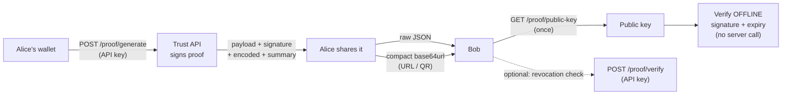

# Proof Verification Flow (Week 9)

**Read this one document to integrate.** It covers the full journey — a wallet
gets a proof, shares it, and anyone verifies it — with real commands, how to
verify **offline** with only our public key, and how to handle every failure
case.

A *proof* is a time-bounded, Ed25519-signed attestation of a wallet's trust
assessment (see [`proof.md`](proof.md) for the exact signed payload and the
canonical-JSON rules). Week 9 turns that capability into a self-contained,
shareable artifact: **Wallet → Generate → Share → Verify.**



The two verification paths differ in exactly one way: **offline** verification
(recommended, no auth, no callback) checks the signature and expiry; the
**server** path additionally checks **revocation**, which lives in our database.

---

## 1. Generate a proof

`POST /proof/generate` scores the wallet (the same engine as `/verify`) and
returns a **self-contained** proof — everything a verifier needs, no callback.

```bash
curl -sX POST http://localhost:8000/proof/generate \
  -H "Content-Type: application/json" \
  -H "X-API-Key: $TRUST_API_KEY" \
  -d '{"wallet": "0x52908400098527886E0F7030069857D2E4169EE7", "chains": ["ethereum"]}'
```

```jsonc
{
  "payload": {
    "wallet": "0x52908400098527886E0F7030069857D2E4169EE7",
    "human_likelihood": "low",
    "trust_tier": "bronze",
    "confidence_score": 0.0,
    "risk_flags": ["new_wallet", "low_activity", "low_counterparty_diversity", "sybil_suspected"],
    "chains": ["ethereum"],
    "scorer_version": "0.4.0-graph",
    "key_id": "923f8498a80e77d0",
    "issued_at": "2026-07-24T20:00:00+00:00",
    "expires_at": "2026-07-25T20:00:00+00:00",
    "nonce": "9f2c1d4b8e0a7f36c2d5e9018a4b7c63"
  },
  "signature": "<base64 Ed25519 over the canonical payload>",
  "encoded": "eyJwYXlsb2FkIjp7ImNoYWlucyI6WyJldGhlcmV1bSJdLCJjb25m…",  // compact form
  "summary": "0x5290…9EE7: low human-likelihood, bronze tier, confidence 0.0 (scorer 0.4.0-graph, expires 2026-07-25T20:00:00+00:00)"
}
```

- `payload` is exactly the 11 signed fields (the canonical object).
- `signature` is the base64 Ed25519 signature over the canonical payload.
- `encoded` is the compact shareable form (see §2).
- `summary` is a one-line human string for display only (not signed).

Auth: requires a valid API key (`X-API-Key`), then rate-limited. An invalid
wallet returns `400`.

## 2. Share a proof — two interchangeable forms

Both forms carry the **same** self-contained object `{payload, signature}`:

| Form | What it is | Use for |
| --- | --- | --- |
| **Raw JSON** | `{"payload": {…}, "signature": "…"}` | developer integrations, APIs |
| **Compact** | base64url of the canonical JSON of that object | URLs, QR codes |

The compact form (`encoded` above) is URL/QR-safe (`A–Z a–z 0–9 - _`, no
padding). The round-trip is **deterministic**: decode then re-encode yields the
byte-identical string, because both forms serialize the same canonical JSON.

Decode either form back into a proof with the bundled helper:

```python
from trust_api.services.proof.share import decode_proof
proof = decode_proof(shared_string)   # accepts raw JSON OR the compact form
```

## 3. Verify OFFLINE — public key only (recommended)

This is the **public, privacy-neutral, no-auth, no-callback** path. Fetch our
public key once and cache it:

```bash
curl -s http://localhost:8000/proof/public-key
# {"algorithm":"ed25519","key_id":"923f8498a80e77d0",
#  "public_key":"hV0Rb9QS4n29SZCIhO7BGjo2A1KF0qT/V9bisOQ6APs="}
```

Then verify entirely locally. Using this package:

```python
from trust_api.services.proof.offline import verify_offline
from trust_api.services.proof.share import decode_proof

proof = decode_proof(shared_string)
result = verify_offline(public_key_b64, proof)   # optional: now=<datetime> to test expiry
print(result.valid, result.reason)   # True 'ok'
```

**Language-agnostic recipe** (any Ed25519 library works — no need for our code):

1. Parse the shared object into `payload` (dict) and `signature` (base64).
2. Confirm the key: `sha256(base64_decode(public_key))[:16]` (hex) must equal
   `payload.key_id`. If not → `unknown_key`.
3. Re-serialize `payload` as **canonical JSON** — keys sorted lexicographically,
   separators `,`/`:` (no spaces), UTF-8, `ensure_ascii=false` — and Ed25519-verify
   the signature over those bytes. Invalid → `bad_signature`. (Canonical rules and
   the cross-language number caveat are in [`proof.md`](proof.md).)
4. Reject if `now > payload.expires_at` → `expired`.
5. Otherwise → `ok`.

Offline verification **cannot** see revocation (that lives in our DB). If your
use case must honor revocation, use §4.

## 4. Verify via the server (optional — adds revocation)

`POST /proof/verify` runs the same signature + expiry checks **and** consults
our database for revocation. Submit the proof in either form:

```bash
# compact form
curl -sX POST http://localhost:8000/proof/verify \
  -H "Content-Type: application/json" -H "X-API-Key: $TRUST_API_KEY" \
  -d '{"encoded": "eyJwYXlsb2Fk…"}'

# or raw JSON form
curl -sX POST http://localhost:8000/proof/verify \
  -H "Content-Type: application/json" -H "X-API-Key: $TRUST_API_KEY" \
  -d '{"payload": {…}, "signature": "…"}'
```

```json
{"valid": true, "reason": "ok", "key_id": "923f8498a80e77d0",
 "expires_at": "2026-07-25T20:00:00+00:00", "revoked": false,
 "summary": "0x5290…9EE7: low human-likelihood, bronze tier, …"}
```

### Does this endpoint require auth? Yes — and here's why.

The server endpoint **requires an API key** (like the rest of the API). A
verification is not free — it is a signature check plus a database lookup — and
an open endpoint invites anonymous **verification farming / DoS**. Crucially,
requiring auth here costs integrators nothing, because the genuinely public path
is **offline verification (§3)**: it needs no key, no network, and no callback
to us. So we get abuse protection on the server path *and* a fully open public
path — the offline one, which is also the one we recommend.

A malformed request (an `encoded` string that isn't valid base64url-of-JSON, or
a body with neither `encoded` nor a complete `payload`+`signature`) returns
`422` with a clear message. A cryptographically invalid proof returns `200` with
`valid: false` and a `reason` (below).

## Handling every verification result

Both paths return the same `reason` vocabulary. Treat only `ok` as trustworthy.

| `reason` | Meaning | What the integrator should do |
| --- | --- | --- |
| `ok` | Signature valid, not expired, not revoked | Trust the assessment in `payload`. |
| `expired` | Signature valid but past `expires_at` | Ask the wallet for a fresh proof (re-run §1). |
| `bad_signature` | Payload was altered, or signature is malformed/wrong | Reject — the proof was tampered with or corrupted. Do **not** trust `payload`. |
| `revoked` | We revoked this proof (server path only) | Reject. Offline verifiers who must honor revocation should use §4. |
| `unknown_key` | `key_id` doesn't match the key you verified against | You used the wrong/old public key, or the proof isn't ours. Re-fetch `GET /proof/public-key` (keys can rotate) and retry. |

`valid` is `true` only for `ok`; it is `false` for every other reason.

## Try the whole thing — one command

The end-to-end journey is a runnable script (it *is* the demo):

```bash
python -m trust_api.demo.proof_flow
```

It prints each step — Alice generates a proof, serializes it both ways, Bob
verifies offline and via the server — and then demonstrates all four failure
modes (expired, tampered, revoked, wrong key). Point it at a running API with
`API_URL` (default `http://localhost:18000` for the local compose stack) and set
`DATABASE_URL` so revocation is visible to the same database the API reads.

## ⚠️ Privacy: a shared proof reveals the wallet address

**Sharing a proof discloses the wallet address and its full assessment.** The
signed `payload` contains `wallet` (the address, verbatim), `trust_tier`,
`human_likelihood`, `confidence_score`, and `risk_flags`. The compact form is
**base64url, not encryption** — anyone holding the proof can decode it and read
all of that. A proof in a URL or QR code is therefore as public as the wallet
address itself.

What this means in practice:

- **Do not treat the compact form as a secret or a bearer token.** It is a
  publicly verifiable claim about a *known* address, not a capability.
- **Whoever you share a proof with learns the wallet address.** If linking an
  address to a person is sensitive in your context, sharing the proof shares
  that link. Share deliberately.
- There is **no raw transaction data** in a proof — only the assessment
  outputs and the address (a deliberate invariant; see [`proof.md`](proof.md)).
  The address disclosure is the privacy consideration to weigh.

If you need to share *that a wallet was assessed* without revealing *which*
wallet, this proof format does not do that — it is out of scope for Week 9 and
would require a different (e.g. zero-knowledge) construction.
